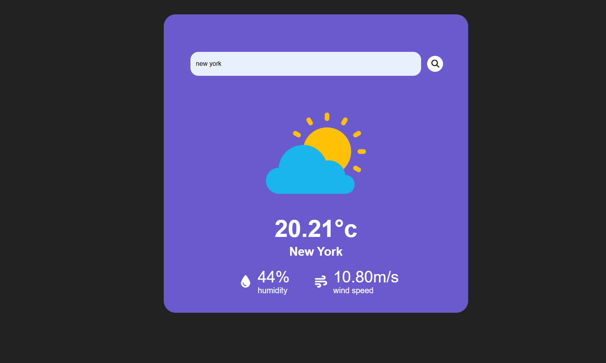

# 🌤️ Weather App


A simple and clean Weather App that fetches real-time weather data for any city using the OpenWeather API.

---

## Preview

<p align="center">
  
</p>

---

## ✨ Features

- 🔍 Search weather by city name
- 🌡️ Shows temperature and weather conditions
- 💧 Displays humidity and additional weather details
- ⚡ Real-time weather data using OpenWeather API
- 🎨 Clean and responsive UI

---

## 🛠️ Tech Stack

### Frontend
- HTML
- CSS
- JavaScript

### API
- OpenWeather API

---

## 💡 What I Learned

Through this project, I learned:
- Fetching API data using JavaScript
- Working with async/await
- Handling JSON responses
- DOM manipulation
- Error handling
- Displaying dynamic data on the UI

---

## 🚀 Future Improvements

- 📍 Current location weather support
- 🌙 Dark/Light mode
- 📅 5-day weather forecast
- 🎨 Better animations & UI improvements
- 🌐 Support for multiple units (°C / °F)

---

## ⚙️ Setup

### Clone Repository

```bash
git clone https://github.com/notsomohit/weather-app.git
```

### Get OpenWeather API Key

- Create an account at:
  https://openweathermap.org/api
- Generate your API key

### Add API Key

Open `script.js` and replace:

```js
const apiKey = 'YOUR_API_KEY_HERE';
```

with your actual API key.

### Run the App

Simply open `index.html` in your browser.
